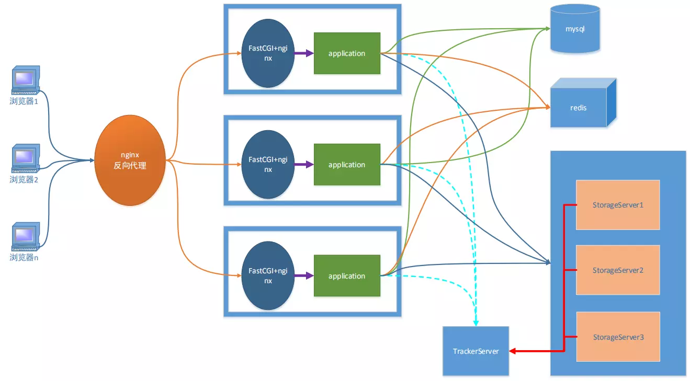
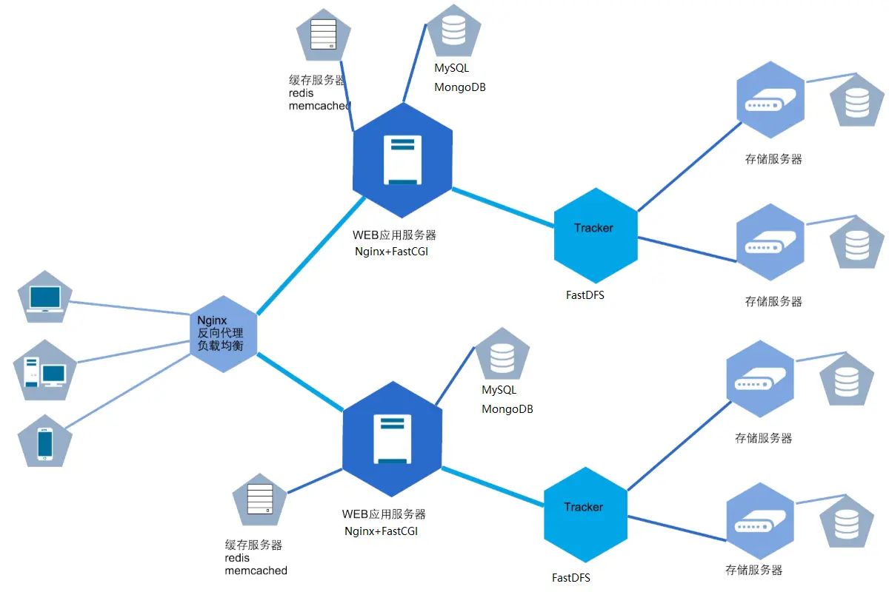

# CloudDisk
高负载的分布式云存储（网络云盘）
## 架构
- 分布式解决方案用FastDFS
- Nginx作为反向代理和轻量级web服务器
- 后台应用程序C/C++完成，用FastCGI包裹生成守护进程
- 上传过程：web服务器接收客户端请求，转发给相应的CGI程序，调用fastDFS接口进行上传
- 下载过程：上传时会将fastDFS返回的文件存储路径记录到数据库中，存储结点部署了服务器，可直接通过url进行下载

    
    

## 功能
- 服务端已经部署在云服务器，并提供了Windows平台的客户端，可直接下载试用
- 支持用户登录注册功能（mysql存储用户信息）
- 支持文件上传、下载（mysql存储用户文件信息，redis存储用户临时密钥）
- 支持文件共享、秒传

## 目录树
```
 .
├── client
│   └──client.zip             Win32客户端程序
├── bin_cgi                   可执行cgi程序文件夹
│   └──
├── include                   common文件夹对应头文件
│   └──
├── common                    通用库文件夹
│   ├── base64.c              base64编码，简单加密，方便跨平台传输
│   ├── cfg.c                 配置文件读取
│   ├── cJSON.c               json读写
│   ├── deal_mysql.c          mysql读写
│   ├── des.c                 des加密算法（对称加密）
│   ├── make_log.c            日志读写
│   ├── md5.c                 md5编码，文件、用户标记
│   ├── redis_op.c            redis接口与key相关的操作
│   └── util_cgi.c            cgi后台通用接口
├── conf                      配置文件夹
│   ├── cfg.json              各结点的ip与端口信息
│   ├── client.conf           fastDFS客户端配置文件
│   ├── nginx.conf            nginx服务器配置文件
│   ├── mod_fastdfs.conf      nginx服务器fastDFS插件配置文件
│   ├── redis.conf            redis配置文件
│   ├── storage.conf          fastDFS存储节点配置文件
│   └── tracker.conf          fastDFS追踪器配置文件
├── logs                      日志文件夹
│   ├── cgi                   cgi程序日志
│   └── database              数据库日志
├── redis                     redis文件夹
│   ├── dump.rdb              持久化数据
│   ├── redis.log             日志
│   └── redis.pid             进程号
├── src_cgi                   cgi程序源文件
│   ├── dealfile_cgi.c        分享、删除文件、文件pv字段处理CGI程序
│   ├── dealsharefile_cgi.c   共享文件pv字段处理、取消分享、转存文件CGI程序
│   ├── login_cgi.c           登陆后台CGI程序
│   ├── md5_cgi.c             秒传功能的CGI程序
│   ├── myfiles_cgi.c         用户列表展示CGI程序
│   ├── reg_cgi.c             注册后台CGI程序
│   ├── sharefiles_cgi.c      共享文件列表展示CGI程序
│   └── upload_cgi.c          上传文件后台CGI程序
├── redis.sh                  redis启动脚本
├── fastdfs.sh                fastDFS启动脚本
├── fcgi.sh                   cgi程序启动脚本，一个cgi程序一个进程
├── nginx.sh                  nginx启动脚本
├── start.sh                  服务器启动脚本
├── Makefile
└── README.md
```
## 环境与配置
- Ubuntu 16.04以上
- 建议将项目放到home目录下，然后将配置文件中的xxx替换成自己的用户名即可
- nginx 1.10.1 （同时用作web服务器和存储结点服务器）
    - ./conf/nginx.conf需要配置的项目
        - worker_processes 1 工作进程数
        - 在events字段里添加use epoll 使用epoll
        - worker_connections 1024 最大连接数
        - listen 80 默认监听端口为80
        - 静态网页配置
        - 设置反向代理与负载均衡（可选）:
        
            访问域名对应location内设置代理：`location / { proxy_pass http://linux.test;}`

            设置代理的服务器：`upstream linux.test{server ip:port;}`
- fastcgi 2.4.1 （创建守护进程执行cgi程序）
    - 写cgi程序时导入，启动后成为守护进程
    - ./conf/nginx.conf内进行cgi命令请求的转发配置（ip设置为本地，端口号与fcgi.sh里的端口号对应，同时要include同目录下的fastcgi.conf）
- spawn-fcgi 1.6.4 （对nginx收到的命令请求进行转发)
    - 启动命令已写在fcgi.sh中，对cgi命令请求进程转发
- MySQL 5.7.31 （用来存储用户信息，文件信息）
    - 设置远程访问
        - 配置文件/etc/mysql/mysql.cnf内将bind-address = 127.0.0.1注释，允许远程访问
        - 还需要设置远程权限：登录后执行`grant all privileges on 库名.表名 to '用户名'@'IP地址' identified by '密码' with grant option;`，接着执行`flush privileges;`，然后再sudo service mysql restart重启mysql服务
    - 设置utf8字符集
        - 配置文件/etc/mysql/mysql.conf.d/mysqld.cnf在[mysqld]下添加`character-set-server=utf8`，默认使用utf8字符集
        - 配置文件/etc/mysql/conf.d/mysql.cnf,[mysqld]下添加`default-character-set=utf8`
    - 设置字段名不区分大小写
        - 配置文件/etc/mysql/mysql.conf.d/mysqld.cnf在[mysqld]下添加`lower_case_table_names=1`，设置不区分大小写
    - 最后重启mysql服务`sudo service mysql restart`
- redis 3.2.8 （redis服务端，存储用户的key）
    - 配置文件./conf/redis.conf需要配置的项目
        - bind IP 设置后，redis只接收来自该IP的请求
        - protected-mode no 设置为no，才能远程访问
        - port redis运行的端口，默认为6379
        - daemonize yes 以守护进程方式运行
        - pidfile "./redis/redis.pid" 将pid存放在redis/redis.pid文件中
        - timeout 0 设置连接超时时间，为0则不会超时
        - logfile "redis/redis.log" 将日志存放在redis/redis.log文件中
        - redis数据库镜像频率
        - dbfilename dump.rdb 数据库镜像备份文件名称
        - dir ./reids 数据库镜像备份文件的路径
- hiredis（redis客户端） 
- libfastcommon 1.36 安装fastDFS需要的通用库
- fastDFS 5.10 （分布式存储系统，包括客户端、追踪器、存储结点）
    - 追踪器配置文件./conf/tracker.conf需要配置的项
        - bind_addr=192.168.213.128 设置主机IP
        - port=22122 设置端口
        - base_path=/home/xxx/fastdfs 设置log日志、pid等数据的路径
    - 存储结点配置文件./conf/storage.conf需要配置的项
        - group_name=group1 结点所在组名
        - bind_addr=192.168.213.128 设置主机IP
        - port=23000 设置端口
        - base_path=/home/xxx/fastdfs/storage 日志文件保存路径
        - store_path_count=1 设置存储目录数量
        - store_path0=/home/xxx/fastdfs/storage 数据存储路径
        - tracker_server=192.168.213.128:22122 tracker的IP和端口
    - 客户端配置文件./conf/client.conf需要配置的项
        - base_path=/home/xxx/fastdfs/client 日志文件保存路径
        - tracker_server=192.168.213.128:22122 tracker的IP和端口
- fastdfs-nginx-module 1.16 存储结点nginx服务器fastdfs插件
    - 为存储结点服务器配置nginx，方便直接通过url访问，由于用的同一台主机，对应配置文件./conf/mod_fastdfs.conf，编辑后会被拷贝到/etc/fdfs目录下
    - base_path=/home/xxx/fastdfs/storage
    - tracker_server=192.168.213.128:22122
    - storage_server_port=23000
    - group_name=group1
    - url_have_group_name=true 浏览器访问时要包含组名
    - store_path_count=1
    - store_path0=/home/xxx/fastdfs/sotrage

## 服务器部署步骤
- 生成可执行的cgi程序

    在当前目录下执行make编译,src_cgi目录下的cgi程序编译后，生成的可执行文件放在bin_cgi目录下
- 修改配置文件

    修改cfg.json中的相关数据，与前面修改的配置文件一致
- 执行启动脚本文件

    sudo ./start.sh

## 客户端下载运行
项目提供了一个Windows平台可执行的客户端exe程序，下载解压后点击CloudDisk.exe即可运行，注册登录后，即可上传下载分享文件